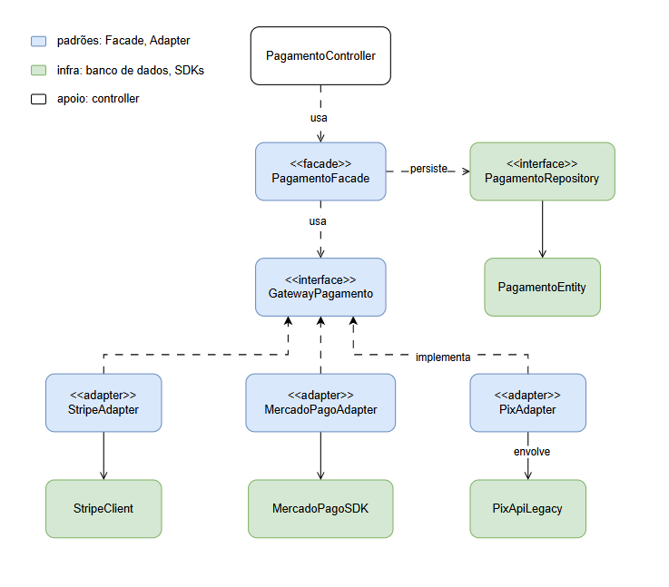

# Gateway de Pagamentos — Facade + Adapter

Projeto acadêmico da disciplina **Experiência Profissional: Design Patterns** (UNIASSELVI).
O objetivo é demonstrar, em um caso real de **checkout de e-commerce**, a aplicação de dois
padrões de projeto — **Facade** e **Adapter** — em uma camada de integração com múltiplos
provedores de pagamento (**Stripe**, **Mercado Pago** e **Pix**).

> Os padrões **são o produto** deste trabalho, não um detalhe de implementação. A arquitetura
> é mantida explícita e rastreável para corresponder ao diagrama de classes do artigo.

## Os dois padrões

- **Adapter** — cada provedor expõe um SDK com formato próprio (a Stripe trabalha em centavos
  e devolve um objeto; o Mercado Pago usa `double` e status em texto; o Pix é uma API legada
  que retorna `String[]`). Um `*Adapter` por provedor **traduz** esse SDK para um contrato comum
  (`GatewayPagamento`), normalizando entrada, saída e erros.
- **Facade** — `PagamentoFacade` é a **porta única** do subsistema. Recebe os adapters por
  injeção e seleciona o correto pelo método de pagamento, sem nenhum `if/else` ou `switch` de
  provedor. O controller REST conversa **apenas** com ela.

**Regra de ouro:** adicionar ou trocar um provedor afeta somente o seu adapter (+ um valor no
enum `Metodo`). Controller e Facade nunca conhecem SDK nem banco de dados.

## Arquitetura

```
PagamentoController → PagamentoFacade → GatewayPagamento → *Adapter → SDK/legado
```



| Camada | Classe(s) | Papel |
|---|---|---|
| Borda REST | `PagamentoController` | Recebe a requisição, valida e delega à Facade |
| Facade | `PagamentoFacade` | Ponto único; seleciona o adapter; persiste o histórico |
| Contrato | `GatewayPagamento` | Interface comum (`processar`, `metodoSuportado`) |
| Adapters | `StripeAdapter`, `MercadoPagoAdapter`, `PixAdapter` | Traduzem cada SDK |
| SDKs (simulados) | `StripeClient`, `MercadoPagoSDK`, `PixApiLegada` | Provedores externos |
| Domínio | `Pagamento`, `ResultadoPagamento`, `Metodo` | Objetos de valor imutáveis |
| Persistência | `PagamentoEntity`, `PagamentoRepository` | Histórico no H2 |

## Estrutura do monorepo

```
apps/
├── checkout/        # backend — Spring Boot (Java 21), pacote com.payments.checkout
└── checkout-web/    # frontend — Angular 21 (standalone) + Tailwind CSS v4
docs/                # diagramas e capturas de tela
```

## Stack

- **Backend:** Java 21, Spring Boot 4.1, Spring Web MVC, Bean Validation, Spring Data JPA,
  banco **H2** em memória, Lombok. Testes com JUnit 5 + Mockito.
- **Frontend:** Angular 21 (componentes standalone, signals), Tailwind CSS v4, Vitest.

## Como executar

### Backend (`apps/checkout`)

Requer **JDK 21**.

```bash
cd apps/checkout
./mvnw spring-boot:run        # sobe a API em http://localhost:8080
./mvnw test                   # roda os testes
```

> ⚠️ Se o `JAVA_HOME` da máquina apontar para outra versão, prefixe o comando, por exemplo:
> `JAVA_HOME="C:/Program Files/Java/jdk-21" ./mvnw.cmd spring-boot:run`.

### Frontend (`apps/checkout-web`)

```bash
cd apps/checkout-web
npm install
npm start                     # http://localhost:4200
npm run build                 # build de produção
npm test                      # testes (Vitest)
```

### Docker (backend)

```bash
docker build -t checkout:latest apps/checkout
docker run -p 8080:8080 checkout:latest
```

### VS Code

Há uma configuração de run **"Backend: CheckoutApplication"** em `.vscode/launch.json`
(requer o *Extension Pack for Java*).

## API

| Método | Rota | Descrição |
|---|---|---|
| `POST` | `/pagamentos` | Processa um pagamento; retorna o resultado normalizado |
| `GET` | `/pagamentos` | Lista o histórico persistido no H2 |
| `GET` | `/pagamentos/metodos` | Métodos disponíveis (derivados dos adapters registrados) |

Exemplo:

```bash
curl -X POST http://localhost:8080/pagamentos \
  -H "Content-Type: application/json" \
  -d '{"metodo":"STRIPE","valor":149.90,"moeda":"BRL","cliente":"ana@exemplo.com"}'
```

Resposta (mesma estrutura para **qualquer** provedor — é o Adapter normalizando):

```json
{ "sucesso": true, "idTransacao": "ch_8954e", "mensagem": "Pagamento aprovado pela Stripe", "metodo": "STRIPE" }
```

Payload inválido retorna **HTTP 400** com os campos com erro.

### Console do H2

Com o backend no ar: **http://localhost:8080/h2-console**
(JDBC URL `jdbc:h2:mem:checkout`, usuário `sa`, senha em branco). Por ser em memória, os dados
são reiniciados a cada restart.

## Frontend de demonstração

A aplicação web é o instrumento que **comprova** os padrões em funcionamento, com duas páginas:

- **Checkout** — um único formulário e um único endpoint para os três provedores (prova a
  Facade). O botão *"Rodar os 3"* dispara a mesma chamada para os três métodos e mostra as
  respostas lado a lado — com **estrutura idêntica**, evidenciando o Adapter.
- **Histórico** — tabela com os pagamentos persistidos no H2.

## Testes

O backend possui **14 testes** (um por adapter, mais Facade e Controller):

```bash
cd apps/checkout && ./mvnw test
```

## Licença

Distribuído sob a licença [MIT](LICENSE).
